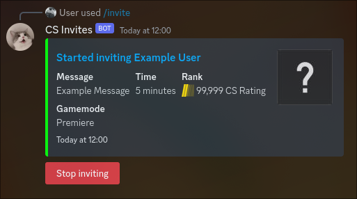
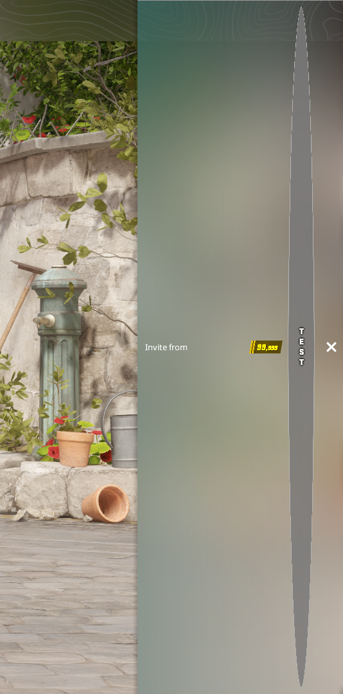

  
   
  <h1>CS Invite Bot</h1>
  <h3>A CS2 (and CS:GO) lobby invitation tool, controlled via a Discord bot.</h3>

## About The Project

  
  

### What is this tool?

This tool is used to send Counter-Strike lobby invites to any user currently playing the game. The tool is controlled with a custom Discord bot, supports multiple Steam accounts allowing multiple users to use the application simultaneously, as well as supports spoofing the skill group of the bot sending the invite as well as its location (country code).

The tool works by emulating a headless Counter-Strike game client and manually sending the network traffic packets (protobufs) used to connect to the internal Steam- & Counter-Strike Game Coordinator APIs, creating a lobby with the spoofed data and inviting users to said lobby.

### Why is this tool special?

Due to the tool directly communicating with the Game Coordinators, it allows any value to be provided and used due to a lack of data validation in the Coordinators. The key feature of this lack of validation is the possibility of adding Unicode characters to the lobby location, allowing the use of line break characters.

The lobby location is usually designed to be the two-letter country code of the person inviting, but due to the direct access to the Game Coordinators, it is possible to provide any value. By adding line break characters to this location, the in-game user interface when receiving invites expands vertically. This results in, with enough line breaks, the received invite filling up the entire screen, blocking the friend's list of the invitee and making it impossible to interact with the invite.

Due to the [Looking to Play](https://counterstrike.fandom.com/wiki/Looking_to_Play) feature of Counter-Strike, which allows players to find people who they are not friends with and invite them to their lobby to play with, Counter-Strike is by default configured to receive and display lobby invitations from any user. This feature allows the tool to invite any user, as long as you have their steam64 ID. The tool includes a profile URL resolver to extract the steam64 ID from any profile URL or custom vanity ID.

### Why am I releasing this tool now?

I started development on this tool well over two years ago and have been keeping it for myself until now. I have over the years used this tool for personal use and have one time used it to [invite every single actively playing CS:GO player](https://exrode.com/counter-strike/csgo-players-get-invitations-from-random-people-en-masse-how-to-defend-yourself-against-it-and-why-is-it-happening). During this time I have been asked for access to the tool but recognized the tool could have the potential for harm if it got into the wrong hands (for example very convincing phishing).

In CS:GO, invites make a (very annoying) sound every time you receive one. This sound plays both in the main menu and while you are playing in a match.

With the introduction of CS2, invites no longer make a sound while in a match and only on the main menu (they are still being received and can be seen even after the invite session has ended once the user pauses their game or the match has ended, and they are sent back to the main menu). This removes one of the major (ab)uses of the tool (getting everyone's attention and possibly annoying focused players) and I therefore believe the tool is not too much of a threat anymore and is fine to release.

## Getting Started

### Requirements

-   [Node.js](https://nodejs.org/en)
-   At least one [**PRIME** (Premium) spare Counter-Strike account](https://store.steampowered.com/app/730/CounterStrike_2/) used as the invite bot
-   A [Discord application registered from the Discord Developer Portal](https://discord.com/developers/applications) with a:
    -   Application Bot Token
    -   Application Client ID
-   A [Steam Web API key](https://steamcommunity.com/dev)
-   A Discord server where your bot will run in

### Setting up and running the tool

1. Clone the repository locally

2. Rename `.env-example` to `.env` and fill in the required values:

    - `DISCORD_TOKEN`: The login token of your Discord bot
    - `DISCORD_CLIENT_ID`: The Client ID of your Discord application
    - `STEAM_API`: Your Steam Web API key
    - `DEVELOPMENT_GUILD_ID`: [The ID of your Discord server ](https://support.discord.com/hc/en-us/articles/206346498-Where-can-I-find-my-User-Server-Message-ID-)

3. Rename `bots-example.txt` to `bots.txt` and fill in the login information of your bot Steam accounts (one account per line). The format is as follows:

    - If you have a Shared Secret (2FA code generator):
      `USERNAME:PASSWORD:SHARED_SECRET`

    - If you **DON'T** have a Shared Secret (requires inputting 2FA code on every restart if the account has [Steam Guard](https://help.steampowered.com/en/faqs/view/06B0-26E6-2CF8-254C) enabled): `USERNAME:PASSWORD`

4. Invite your Discord bot to your server (To avoid dealing with permission issues, make sure your bot has `Administrator` privileges when generating the invite URL)

5. Install the required packages with `npm i`

6. Run the tool with `npm start`

### Usage

The bot currently only features two commands:

-   `/generate-info`: Generates an info embed showing a short explanation of the functionality and commands of the Discord bot.
-   `/invite [profile] [message] (rank) (time) (gamemode)`: Starts a new invite session with your parameters. The parameters are as follows:

    -   `profile`: The profile to invite. This can be a Steam64, vanity ID or profile URL
    -   `message`: The message to include in the invites (max 60 characters)
    -   `rank`: (Optional) The rank shown in the invite.

        -   If the selected gamemode is **Premiere**, the rank will be shown as a CS Rating and goes between **1 - 99,999**.
        -   If the selected gamemode is **Wingman**, the rank will show as the classic CS Skill Groups and goes between **1 - 18**.

        Defaults to CS Rating 99,999 (Premiere) or The Global Elite (Wingman)

    -   `time`: (Optional) The time to invite for. Defaults to 5 minutes
    -   `gamemode`: (Optional) The gamemode of the rank. Defaults to Premiere

## Will I get banned for using this?

Despite myself never having gotten banned for using this for well over two year and having invited thousands of people, I cannot guarantee the same won't happen to you. This tool does not initialize [VAC](https://help.steampowered.com/en/faqs/view/571A-97DA-70E9-FF74) and therefore VAC-bans should not be possible, but manual bans (such as a [Community Ban](https://help.steampowered.com/en/faqs/view/4F62-35F9-F395-5C23) or a [manual Game Ban](https://help.steampowered.com/en/faqs/view/4E54-0B96-D0A4-1557)) could still occur. Use this tool at your own risk and only use Steam bot accounts you would be willing to potentially lose.

Despite the tool automatically hiding the Steam bot account by making the name invisible and the location expanding making it impossible to interact with the invite (and see the account that is inviting you), it is still possible in a very unlikely scenario for somebody to dump the network packets and find your account.

### **[TSUKANI//DEV](https://tsukani.dev)**
